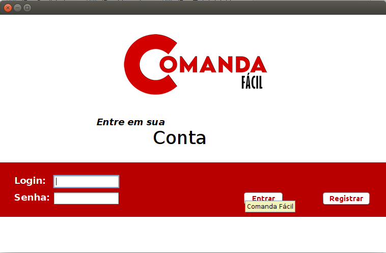
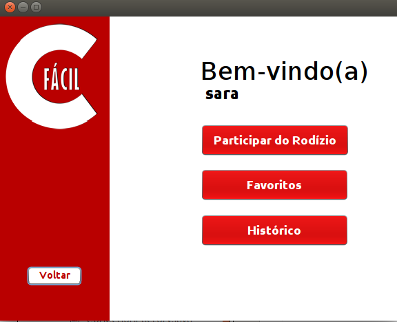
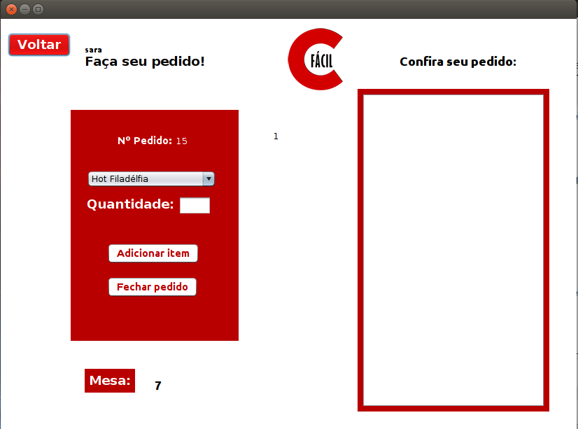
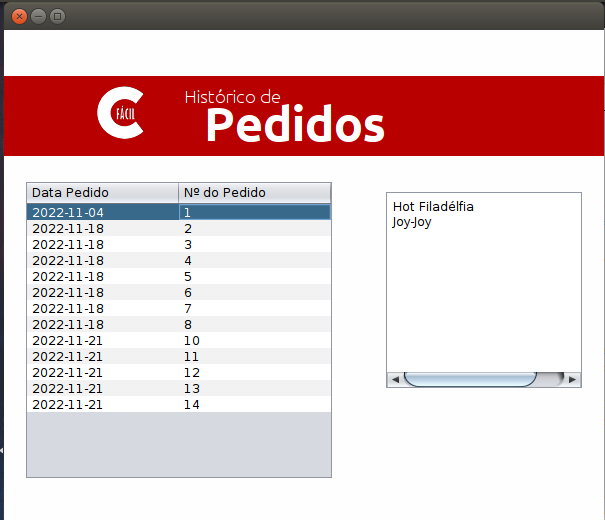

# projetosFinal0730-11

Projeto final do técnico de informática

Criamos um protótipo de uma comanda digital usando Java,a ideia é que tenha uma tela inicial de login e registro, em seguida a tela de menu e as telas de pedido e histórico.

